# **PasswordVault — Secure Password Manager CLI**

**PasswordVault** is an offline, cryptographically secure password manager written in Python. It operates offline by default and stores all data in a single encrypted vault file.

It was built as a personal tool to organize account information, improve password strength, and store data safely on a local machine without relying on any cloud service.

---
# Features

### Core Security

- Authenticated encryption for all vault data with integrity protection
- Hierarchical key architecture (v2.0+)
- Master key derived using a memory-hard password-based key derivation function
- Optional TPM-backed key sealing (device-bound security)
- Per-entry secret encryption — secrets remain encrypted until explicitly requested
- Atomic file saves – never lose data on crash or power loss

### Password Management

- Truly random password generator using Python’s `secrets` module (customizable)
- Machine-generated Diceware passphrase generator with randomized capitalization, separators, and digit placement
- Copy masked passwords to clipboard, auto clears after set time (configurable)
- Password history (configurable)
- Secure clipboard handling with auto-clear (configurable)

### Two-Factor Authentication

- Secure encrypted storage of TOTP secrets
- Built-in TOTP code generation
- QR-code–compatible OTP URI support

### Optional Security Auditing

- Checks all passwords for  strength, online exposure, and reuse across accounts.
- Password strength analysis using a combination of heuristics, `zxcvbn`, and post-quantum bonus.
- Breach exposure checks via **Have I Been Pwned** (online, with k-anonymity)
- Detection of reused passwords accross account in the vault
- Severity-sorted results wit optional CSV export

### Import / Export & Migration

- Plaintext JSON & CSV export for backups and migrations
- Re-import of exported plaintext JSON backup
- CSV import support for migrating from other password managers and browser exports
- Portable mode vault import/export.

---

# Screenshots
<b>Entry list and search</b>
<p>
  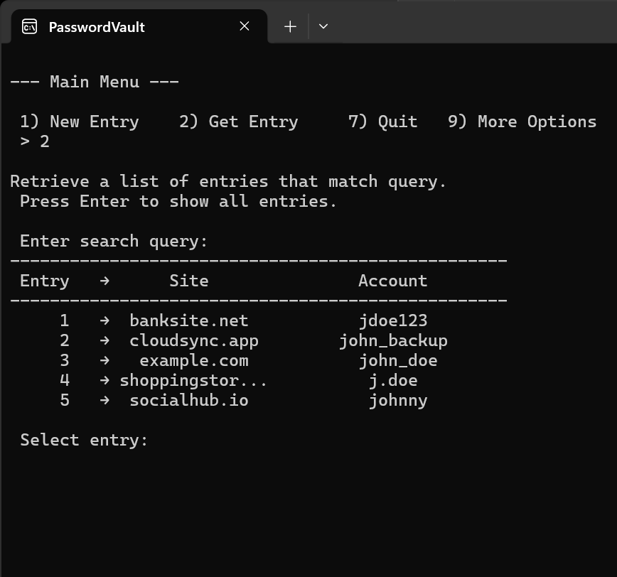
  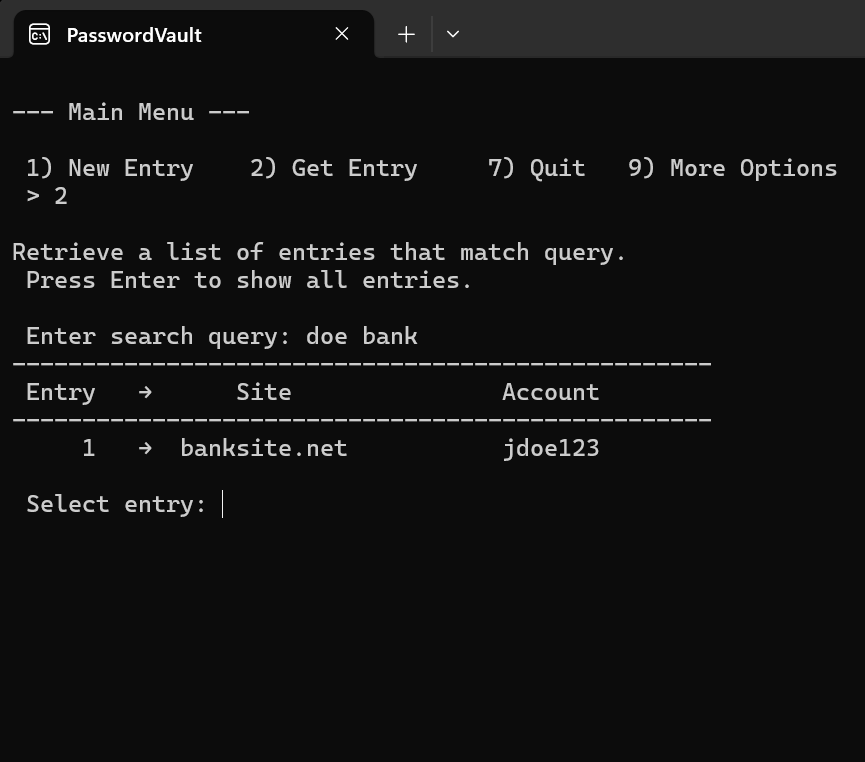
</p>
<b>Entry information display</b>
<p>
  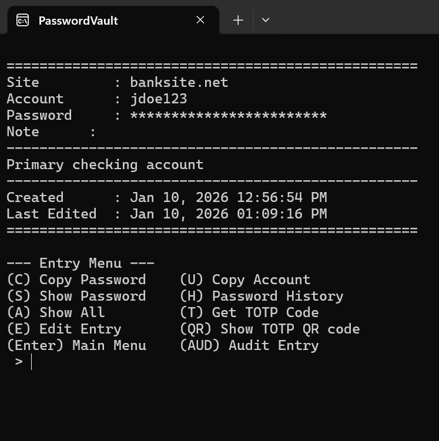
  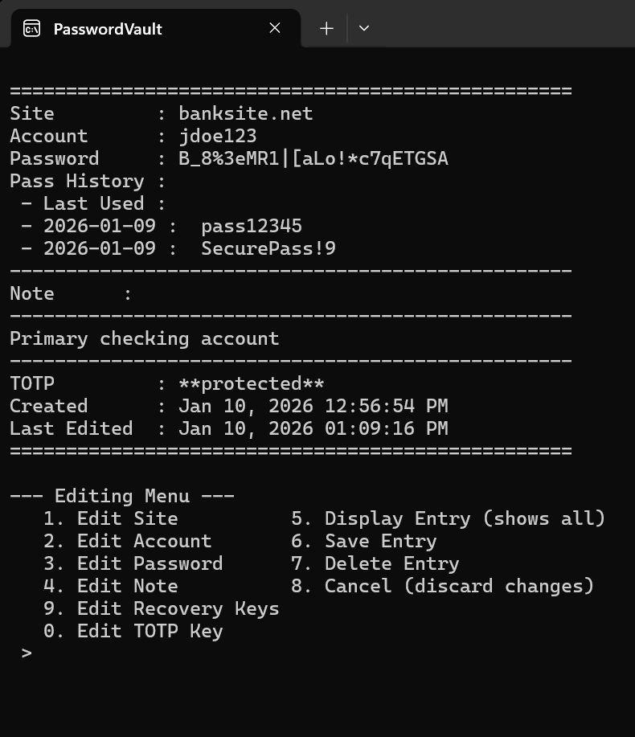
</p>
<b>Password Generation</b>
<p>
  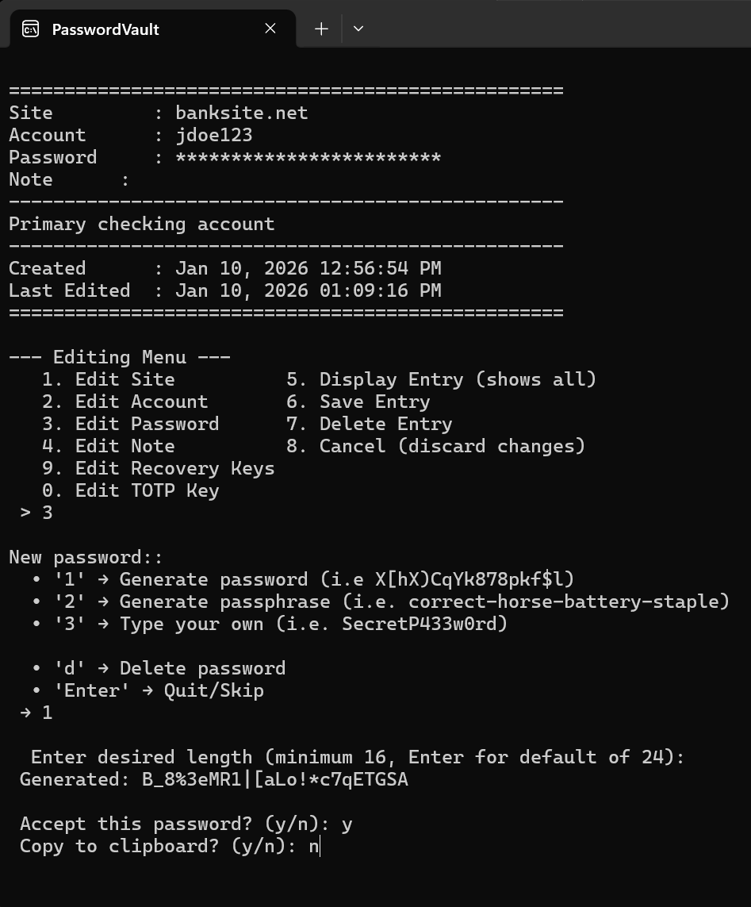
  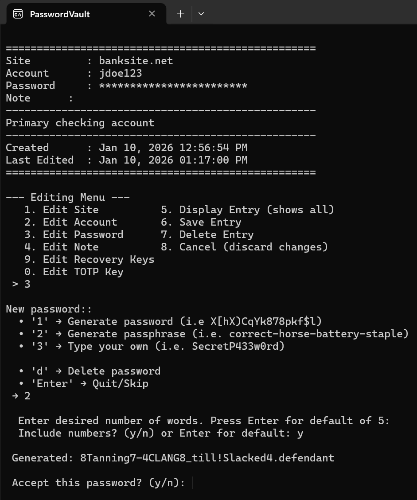
</p>
<b>2FA code generation and adding code to other authenticator app</b>
<p>
  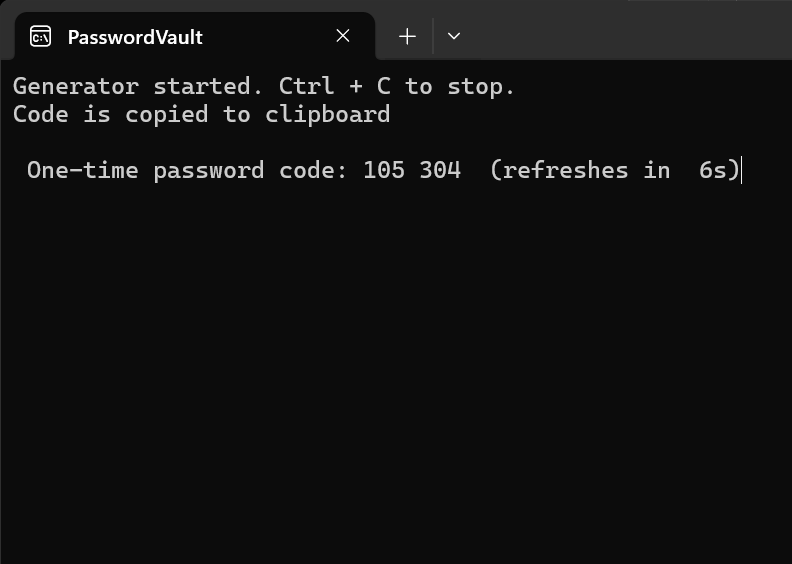
  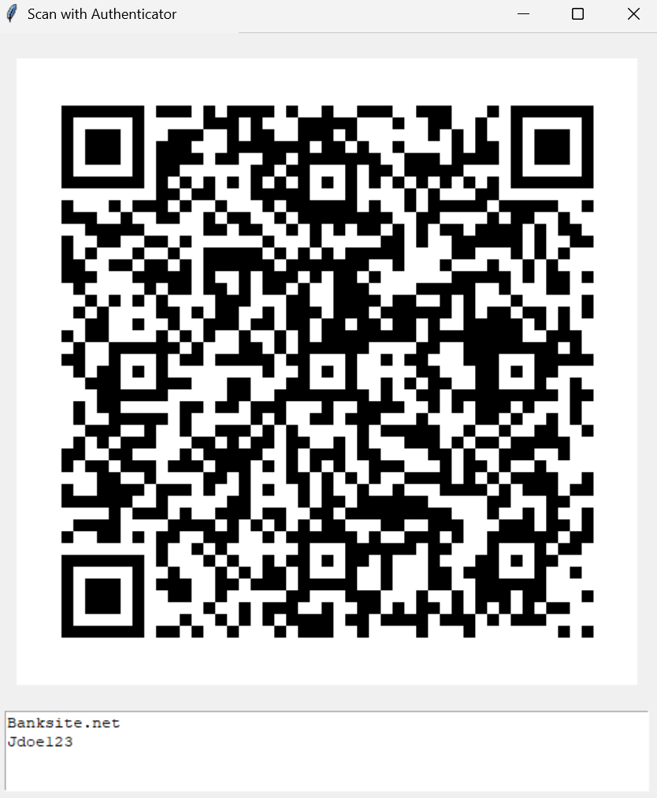
</p>
<b>Password strength test, exposure check, and reuse check</b>
<p>
  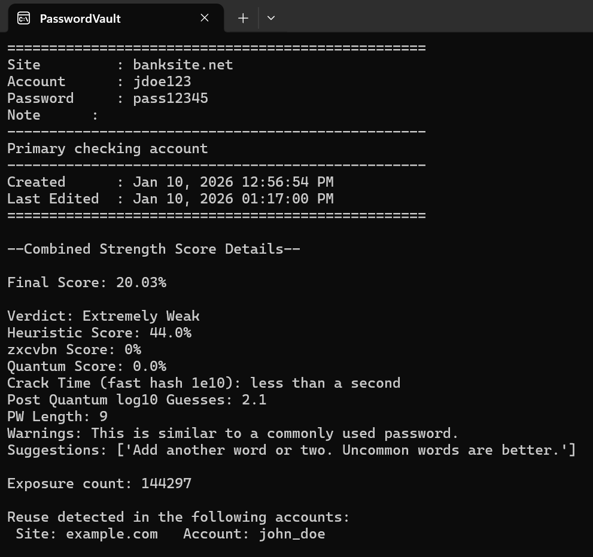
  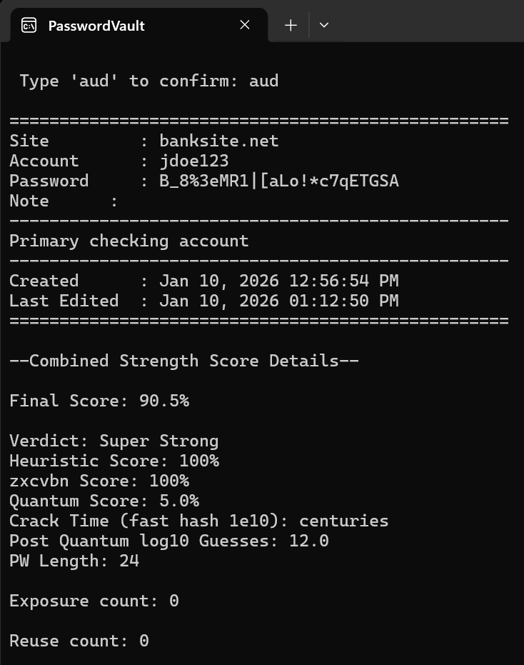
</p>
<b>Audit of all vault passwords</b>
<p>
    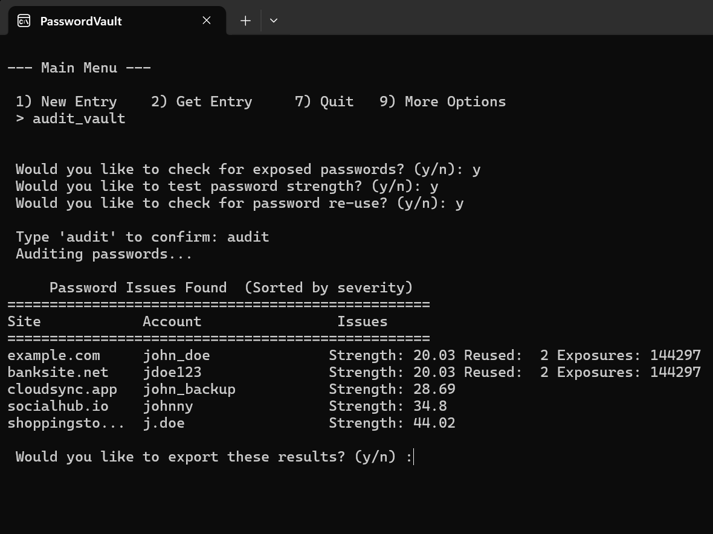
</p>
<b>Other options</b>
<p>
  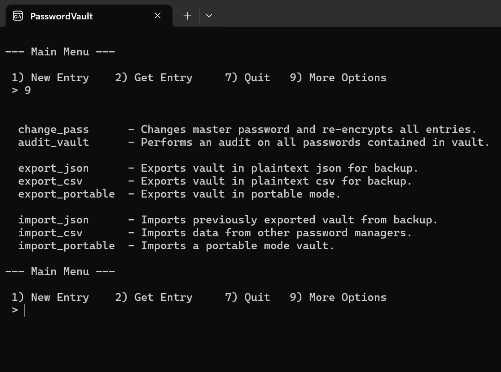
</p>
<b>Encrypted vault file</b>
<p>
  
</p>


# TPM Mode

PasswordVault supports **hardware-backed key sealing** using a **Trusted Platform Module (TPM)**. 

This adds an additional layer on top of your master password to unlock the vault.

When enabled, the vault will **only unlock on the computer it was created on**.

### TPM Protection Guards Against

- Stolen or imaged disks
- Offline brute-force attacks
- Leaked encrypted vault files

### Important Limitations of TPM Mode

While highly recommended, TPM mode is **not** suitable for all users. 

Do **not** enable TPM mode if you require:

- Cross-device vault access
- Cloud sync without re-encryption
- Guaranteed recovery after OS, motherboard, or TPM replacement
- Access after hardware failure or device loss

If the TPM is cleared or the device is lost, TPM-sealed data **cannot** be recovered.

All of these cases are mitigated by creating a **portable mode** backup.


### **Runtime Security**

TPM protection applies **only** while the vault is locked.

This is a limitation shared by all software password managers.

---
# Portable Mode

To support backups and migration, the vault can be exported in **portable mode**. 

Portable mode:

- Re-encrypts all data using only the master password
- Does **not** rely on TPM hardware

Portable mode vaults:

- Can be decrypted on any compatible system
- Are suitable for offsite backups
- Can be imported into new vaults (TPM-enabled or not)

It is strongly recommended to Keep **at least one portable backup** if TPM mode is enabled.

---
## Password Strength Analysis
The vault now includes an advanced password strength tester that goes beyond simple length and character checks. It combines heuristic rules, entropy estimation, and post-quantum considerations to provide a more realistic assessment of password security.

Scores > 90% indicate passwords whose strength is slightly boosted by the post-quantum entropy bonus.

Scores ≥ 95% indicate passwords whose strength meaningfully benefits from the post-quantum entropy bonus.

### Interpreting the Score
| Score (%)      | Verdict                |
|----------------|------------------------|
| [0, 20)        | Unacceptable           |
| [20, 30)       | Extremely Weak         |
| [30, 40)       | Very Weak              |
| [40, 50)       | Weak                   |
| [50, 60)       | Acceptable             |
| [60, 70)       | Decent                 |
| [70, 80)       | Strong                 |
| [80, 90)       | Pretty Strong          |
| [90, 90.5)     | Very Strong            |
| [90.5, 91)     | Super Strong           |
| [91, 95)       | Exceptional            |
| [95, 100)      | Extraordinary          |
| 100      | Post-Quantum Resistant |


# Installation

```bash
git clone https://github.com/LukeTatarsky/PasswordVault.git
cd PasswordVault
pip install -r requirements.txt
python PasswordVault_CLI.py
```


# Configuration

Uses a two-file configuration system:

- `config_vault.py` – Default settings
    - Contains formatting options and security defaults.
- `config_local.py` – Your personal overrides
    - Create this file in the same directory to customize settings without affecting the main config.

Example `config_local.py`:

```python
from config import PASS_DEFAULTS

# Longer default passwords
PASS_DEFAULTS["length"] = 22
PASS_DEFAULTS["min_symbols"] = 4

# Faster clipboard clear
CLIPBOARD_TIMEOUT = 15

# Disable clipboard history wipe
WIPE_CLIPBOARD = False
```


## First Run

- Create a **strong master password**
- There is **no recovery** if the master password is lost
- The encrypted vault is saved as `passwords.vault`

---
## Exporting Data

Your vault is a **single encrypted JSON file**.

### Plaintext JSON

To export a plaintext backup:

1. Run the program
2. Log in
3. Type `export_json` in the main menu

**Warning:** Plaintext exports contain **unencrypted passwords** and must be protected appropriately.

### Plaintext CSV

To export in Portable Mode:

1. Run the program
2. Log in
3. Type `export_csv` in the main menu

**Warning:** Plaintext exports contain **unencrypted passwords** and must be protected appropriately.

### Portable Mode (No TPM)

To export in Portable Mode:

1. Run the program
2. Log in
3. Type `export_portable` in the main menu
4. Choose if you want to use the same password or a different password than the current vault.


See Portable Mode for details.


---
## Importing Data


### CSV Import

Include these fields for main functionality of the script. Anything else will import but will not be shown during runtime.

Note: **site** is a required field.

```
site,account,password,note
example.com,john_doe,P@ssw0rd1,shopping,
google,johndoe@gmail.com,trustno1,Personal email account
```
Unsupported fields are preserved internally and reappear on export.

Currently supports Bitwarden csv exports.

Steps:

1. Run the program
2. Log in
3. Type `import_csv`
4. Enter filename (do not include extension)

### JSON Import

- Import previously exported plaintext or encrypted (portable mode) vaults.

Steps:

1. Run the program
2. Log in
3. Type `import_json`
4. Enter filename  (do not include extension)


## Best Practices

- Never run on a compromised or shared system
- Use a long, unique master password
- Back up the encrypted vault regularly.
- If TPM mode is enabled, keep **at least one Portable Mode backup**
    - Store this backup offline and separate from your device
- Maintain at least one plaintext export for disaster recovery
    - Store securely (e.g., encrypted external media or offline storage)


## Disclaimer

This project is intended for personal and educational use. Use at your own risk.

This tool is as secure as your master password and your machine.

No software password manager can completely protect you from malware running on your system.